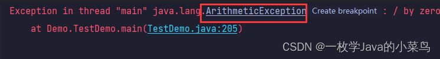
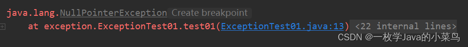
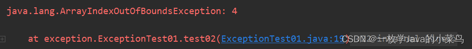
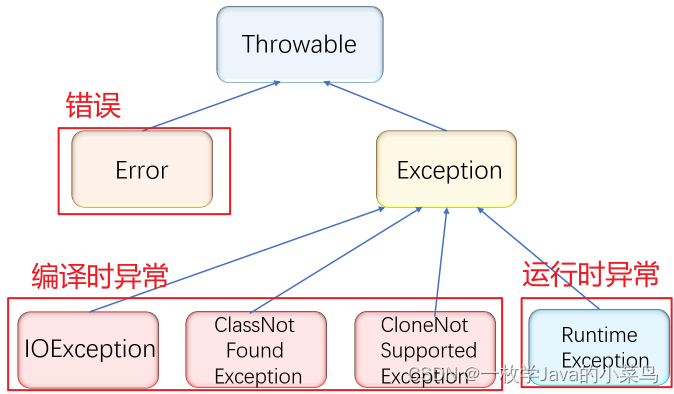
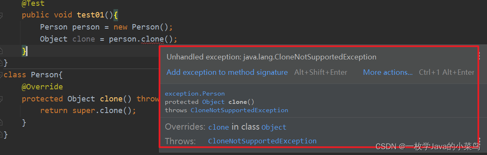
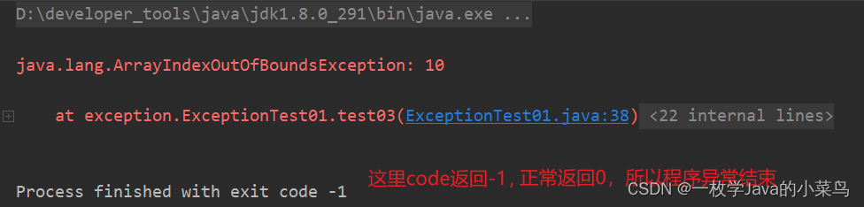
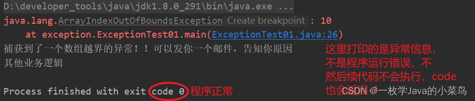

## 【Java SE】异常的认识

### 一、 异常的概念与体系结构

#### 1.1、异常的概念

在java中，将程序执行过程中发生的不正常行为称为异常。

常见的几种异常：

1. 算数异常

```java
public static void main1(String[] args) {
    int a = 10/0 ;
    System.out.println(a);
}
```


2. 空指针异常（引用=null）
   ```java
   	//NullPointerException
       @Test
       public void test01(){
           int[] arr = null;
           System.out.println(arr.length);
       }
   ```
   

   

3. 数组角标越界异常
   ```java
   //ArrayIndexOutOfBoundsException
       @Test
       public void test02(){
           int[] arr = {1,2,3,4};
           System.out.println(arr[4]);
       }
   ```
   


#### 1.2、异常的体系结构

异常种类繁多，为了对不同异常或者错误进行很好的分类管理，Java内部维护了一个异常的体系结构：




像最右边的运行时异常，还有很多子类，比如上面举例的数组越界啊等等，最左边的`IO`异常也有很多子类，这里就不一一列举了。

从上面的图我们也可也分析到：`Throwable `是异常体系的顶层类，派生出两个重要的子类，分别是`Error` 和 `Exception`。

`Error`：指的是Java虚拟机无法解决的严重问题，比如栈溢出，堆资源耗尽，`JVM`内部错误等，一旦发生了就没有回天之术了！

`Exception`：这个指的是产生了异常之后，程序员可以通过对代码进行处理，使程序继续执行，好比如说我除数写成 0 了，我发现异常了，我修改即可，我们平时说的异常就是`Exception`！

#### 1.3、异常的分类

异常可能在编译时发生，也可能在程序运行时发生，根据发生的时机不同，可以将异常分为：

1. 编译时异常
   在程序编译期间发生的异常，称为编译时异常，也称为受检查异常(Checked Exception)

   ```java
   class Person{
       @Override
       protected Object clone() throws CloneNotSupportedException {
           return super.clone();
       }
   }
   ```

   


   `注意：少了等于号，分号，逗号等等的属于编译时语法错误，是编译错误，不属于异常`

2. 运行时异常

   在程序执行期间发生的异常，称为运行时异常，也称为非受检查异常(`Unchecked Exception`)
   `RunTimeException`以及其子类对应的异常，都称为运行时异常。比如：`NullPointerException、ArrayIndexOutOfBoundsException、ArithmeticException`。
   例如我们的数组越界：

   数组角标越界异常

   ```java
   //ArrayIndexOutOfBoundsException
       @Test
       public void test02(){
           int[] arr = {1,2,3,4};
           System.out.println(arr[4]);
       }
   ```

   


### 二、异常的处理方式

#### 2.1、异常的抛出

在编写程序时，如果程序中出现错误，此时就需要将错误的信息告知给调用者，比如：参数检测。在Java中，可以借助throw关键字，

抛出一个指定的异常对象，将错误信息告知给调用者。

> 注意：
>
> 1.`throw`必须写在方法体内部
> 2.抛出的对象必须是`Exception` 或者 `Exception` 的子类对象
> 3.如果抛出的是 `RunTimeException` 或者 `RunTimeException` 的子类，则可以不用处理，直接交给`JVM`来处理
> 4.如果抛出的是编译时异常，用户必须处理，否则无法通过编译
> 5.异常一旦抛出，其后的代码就不会执行

#### 2.2、异常的捕获

异常的捕获，也就是异常的具体处理方式，主要有两种：`异常声明throws `以及 `try-catch捕获处理`。

##### 2.2.1、异常声明throws

处在方法声明时参数列表之后，当方法中抛出编译时异常，用户不想处理该异常，此时就可以借助throws将异常抛给方法的调用者来处

理。即当前方法不处理异常，提醒方法的调用者处理异常。

语法格式：

```
修饰符 返回值类型 方法名(参数列表) throws 异常类型1，异常类型2...{}
```

1. 在方法中使用`throws`之后，在主函数里调用者必须要处理
2. 如果方法中没有声明异常，而是直接处理了异常，则在函数里可以直接调用
3. 方法中处理了异常，在函数中又`throws`之后，此时还是没有处理异常，所以交给了`JVM`

> 注意：
>
> 1、throws必须跟在方法的参数列表之后
>
> 2、声明的异常必须是 Exception 或者 Exception 的子类
>
> 3、方法内部如果抛出了多个异常，throws之后必须跟多个异常类型，之间用逗号隔开，如果抛出多个异常类型具有父子关系，直接声明父类即可。
>
> 4、调用声明抛出异常的方法时，调用者必须对该异常进行处理，或者继续使用throws抛出

##### 2.2.2、try-catch捕获并处理

throws对异常并没有真正处理，而是将异常报告给抛出异常方法的调用者，由调用者处理。如果真正要对异常进行处理，就需要try-catch。

语法格式：

```java
 public static void main(String[] args) {
        try{
			// 将可能出现异常的代码放在这里
        }catch(要捕获的异常类型 e){
			// 如果try中的代码抛出异常了，此处catch捕获时异常类型与try中抛出的异常类型一致时，或者是try中抛出异常的基类时，就会被捕获到
			// 对异常就可以正常处理，处理完成后，跳出try-catch结构，继续执行后序代码
        }catch(异常类型 e){
			// 对异常进行处理
        }finally{
			// 此处代码一定会被执行到
        }
		// 后序代码
		// 当异常被捕获到时，异常就被处理了，这里的后序代码一定会执行
		// 如果捕获了，由于捕获时类型不对，那就没有捕获到，这里的代码就不会被执行
    }
```

当我们再拿出数组越界这段代码的时候可以看到没有处理异常，那么就会交给`JVM`来处理，此时程序会立即异常终止，`code`返回1

```java
public  void test03() {
        int[] array = {1,2,3,4,5};

        System.out.println(array[10]);//此处没有处理异常，那么就会交给JVM来处理，此时程序会立即异常终止

        System.out.println("其他业务逻辑");
}
```



我们使用`try-catch`捕获并处理

```java
public static void main(String[] args) {
        int[] array = {1,2,3,4,5};
        try{
            //System.out.println(array[10]);//此处没有处理异常，那么就会交给JVM来处理，此时程序会立即异常终止
            System.out.println(array[10]);
            System.out.println("hhhh");//只要上面发生了异常，后面的代码就不会执行了
        }catch(ArrayIndexOutOfBoundsException e){//输入异常的类型，变量
            e.printStackTrace();//打印当前异常的信息
            System.out.println("捕获到了一个数组越界的异常！！可以发你一个邮件，告知你原因");
        }
        System.out.println("其他业务逻辑");
    }
```



当然我们这里如果在try里面输入的数据发生了异常，但是`在catch里面没有提及到相关异常的捕捉，那么程序依旧会运行失败`。如果在try里面有多个异常，它只会捕获第一个异常，其余的就不执行了，程序当中，同时只能抛出一个异常。

关于异常的处理方式：

```
1、异常的种类有很多, 我们要根据不同的业务场景来决定.
2、对于比较严重的问题(例如和算钱相关的场景), 应该让程序直接崩溃, 防止造成更严重的后果
3、对于不太严重的问题(大多数场景), 可以记录错误日志, 并通过监控报警程序及时通知程序猿
4、对于可能会恢复的问题(和网络相关的场景), 可以尝试进行重试.
5、在我们当前的代码中采取的是经过简化的第二种方式. 我们记录的错误日志是出现异常的方法调用信息, 能很快速的让我们找到出现异常的位置. 以后在实际工作中我们会采取更完备的方式来记录异常信息.
```
注意：
```java
1、try块内抛出异常位置之后的代码将不会被执行
2、如果抛出异常类型与catch时异常类型不匹配，即异常不会被成功捕获，也就不会被处理，继续往外抛，直到JVM收到后中断程序----异常是按照类型来捕获的
3、try中可能会抛出多个不同的异常对象，则必须用多个catch来捕获----即多种异常，多次捕获
4、如果多个异常的处理方式是完全相同, 也可以写成这样：中间用|来衔接异常，变量名放最后
```

如果异常之间具有父子关系，`一定是子类异常在前catch，父类异常在后catch`，否则语法错误：

```java
public static void main(String[] args) {
  int[] array = {1,2,3,4,5};
   try{
       System.out.println(array[9]);
       System.out.println("haha");
   }catch (NullPointerException e){
       System.out.println("空指针异常！");
       e.printStackTrace();
   }catch (ArrayIndexOutOfBoundsException e){
       System.out.println("数组越界异常！");
       e.printStackTrace();
   }catch (Exception e){//Exception可以捕捉到所有的异常  兜底，必须放在最后
       e.printStackTrace();
   }
}
```

 可以通过一个catch捕获所有的异常，即多个异常，一次捕获(不推荐)，只有具体的异常才能解决具体的问题，捕捉范围太大是不可控的

##### 2.2.3、finally

在写程序时，有些特定的代码，不论程序是否发生异常，都需要执行，比如程序中打开的资源：网络连接、数据库连接、IO流等，在程序正常或者异常退出时，必须要对资源进进行回收。另外，因为异常会引发程序的跳转，可能导致有些语句执行不到，finally就是用来解决这个问题的。

语法格式：

```java
public static void main(String[] args) {
    try{
		// 可能会发生异常的代码
    }catch(异常类型 e){
		// 对捕获到的异常进行处理
    }finally{
		// 此处的语句无论是否发生异常，都会被执行到
    }
	// 如果没有抛出异常，或者异常被捕获处理了，这里的代码也会执行
}
```

代码演练：输入一个数被10整除

```java
public static void main(String[] args) {
    Scanner scanner = new Scanner(System.in);
    try{
        int a = scanner.nextInt();
        System.out.println(10/a);
        System.out.println("abcdefg");
    }catch(ArithmeticException e){
        System.out.println("捕获到了算术异常");
        e.printStackTrace();
    }finally {
        scanner.close();//关闭资源
        System.out.println("一般用来关闭资源！");//不管是否发生异常，finally一定会被执行
    }
    System.out.println("其他业务逻辑");
}
```

###### 1、那有人问既然 finally 和 try-catch-finally 后的代码都会执行，那为什么还要有finally呢？

在一段程序中，如果正常输入，成功接收输入后程序就返回了，try-catch-finally之后的代码根本就没有执行，即输入流就没有被释放，造成资源泄漏

###### 2、finally 的执行时机是什么？

我们先来看下面这段代码：

```java
public class TestDemo {
    public static int func() {
        try {
            return 1;
        } finally {
            return 2;
        }
    }
    public static void main(String[] args) {
        System.out.println(func());
    }
}
```

首先我们要弄清楚，finally 执行的时机是在方法返回之前，如果 try 或 catch 中有 return 语句，会在这个 return 之前执行 finally，如果 finally 中也存在 return 语句，那么就会执行 finally 中的 return 从而不会执行 try 或 catch 原有的 return，一般我们不建议在 finally 中写 return 语句，会被编译器当成是一个警告！

**注意**：finally中的代码一定会执行的，一般在finally中进行一些资源清理的扫尾工作。

#### 2.3、异常的处理流程

异常处理流程总结：

```
1、程序先执行 try 中的代码
2、如果 try 中的代码出现异常, 就会结束 try 中的代码, 看和 catch 中的异常类型是否匹配.
3、如果找到匹配的异常类型, 就会执行 catch 中的代码
4、如果没有找到匹配的异常类型, 就会将异常向上传递到上层调用者
5、无论是否找到匹配的异常类型, finally 中的代码都会被执行到(在该方法结束之前执行)
6、如果上层调用者也没有处理的了异常, 就继续向上传递
7、一直到 main 方法也没有合适的代码处理异常, 就会交给 JVM 来进行处理, 此时程序就会异常终止
```

### 三、自定义异常类

Java 中虽然已经内置了丰富的异常类, 但是并不能完全表示实际开发中所遇到的一些异常，此时就需要维护符合我们实际情况的异常结构

如果要自定义一个异常，那么

1、需要继承于一个异常类，一般我们推荐继承2个中的一个

1. `Exception`：默认就是一个受查异常，或者是一个编译时异常，必须"处理"之后才可以运行，使用try来处理，throws来声明
2. `RuntimeException`：非受查时异常，运行时异常

2、实现一个带有 String 类型参数的构造方法，参数也就是出现异常的原因

**参考 exception 目录下的自定义异常** `GlobalException.java`  和 `VisitormsBusinessException.java`

### 四、全局异常处理

**参考 exception 目录下** `VisitormsBusinessExceptionHandler.java`

**@ControllerAdvice 就是 @Controller 的增强版。@ControllerAdvice 主要用来处理全局数据，一般搭配 @ExceptionHandler 使用。下面分别进行介绍。**

- 优点：将 Controller 层的异常和数据校验的异常进行统一处理，减少模板代码，减少编码量，提升扩展性和可维护性。
- 缺点：只能处理 Controller 层未捕获（往外抛）的异常，对于 Interceptor（拦截器）层的异常，Spring 框架层的异常，就无能为力了。

#### **1，基本用法**

（1）`@ControllerAdvice` 最常见的使用场景就是全局异常处理。假设我们项目中有个文件上传功能，并且对文件上传的大小限制进行了配置。
（2）如果用户上传的文件超过了限制大小，就会抛出异常，此时可以通过 `@ControllerAdvice `结合` @ExceptionHandler` 定义全局异常捕获机制，具体代码如下：

代码说明：

- `GlobalExceptionHandler` 类上面添加了` @ControllerAdvice `注解。当系统启动时，该类就会被扫描到 `Spring `容器中。
- `handleException`方法上面添加了 `@ExceptionHandler` 注解，其中定义的 `Exception.class`（也可以是其他 `Exception` 的子类及`Exception` 的继承自定义类，如`NullPointerException.class`） 表明该方法用来处理` Exception`（`NullPointerException`）类型的异常。如果想让该方法处理所有类型的异常，只需要将 `NullPointerException` 改成` Exception `即可。
- 异常处理方法的参数可以有异常实例、`HttpServletResponse` 以及 `HttpServletRequest`、`Model` 等。 异常处理方法的返回值可以是一段 `JSON`、一个 `ModelAndView`、一个逻辑视图名等。

#### 2、基本使用示例

##### **2.1 @ControllerAdvice 注解定义全局异常处理类**

```java
@ControllerAdvice
public class GlobalExceptionHandler {
}
//请确保此 GlobalExceptionHandler 类能被扫描到并装载进 Spring 容器中。
```

##### **2.2 @ExceptionHandler 注解声明异常处理方法**

```java
@ControllerAdvice
public class GlobalExceptionHandler {
 
    @ExceptionHandler(Exception.class)
    @ResponseBody
    String handleException(){
        return "Exception Deal!";
    }
}
```


