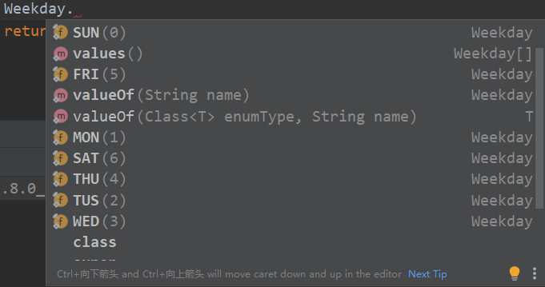
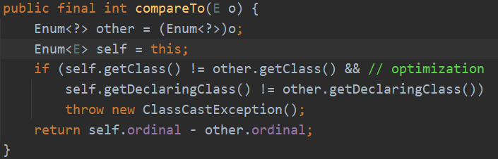

## Enum（枚举类）

### 一、什么情况下使用枚举类?

有的时候一个类的对象是有限且固定的，这种情况下我们使用枚举类就比较方便

### 二、为什么不用静态常量来代替枚举类呢?

```java
public static final int SEASON_SPRING = 1;
public static final int SEASON_SUMMER = 2;
public static final int SEASON_FALL = 3;
public static final int SEASON_WINTER = 4;
```

枚举类更加直观，类型安全。使用常量会有以下几个缺陷：

1. 类型不安全。若一个方法中要求传入季节这个参数，用常量的话，形参就是int类型，开发者传入任意类型的int类型值就行，但是如果是枚举类型的话，就只能传入枚举类中包含的对象。

  2. 没有命名空间。开发者要在命名的时候以SEASON_开头，这样另外一个开发者再看这段代码的时候，才知道这四个常量分别代表季节。

  3. 在没有枚举类的时候，我们要定义一个有限的序列，比如星期几，男人女人，春夏秋冬，一般会通过上面那种静态变量的形式，但是使用那样的形式如果需要一些其他的功能，需要些很多奇奇怪怪的代码。所以，枚举类的出现，就是为了简化这种操作。

     示例：

     ```java
     public enum Weekday {
         SUN(0,"星期日"),MON(1,"星期一"),
         TUS(2,"星期二"),WED(3,"星期三"),
         THU(4,"星期四"),FRI(5,"星期五"),
         SAT(6,"星期六");
         private Integer code;
         private String value;
         private Weekday(Integer code,String value) {
             this.code = code;
             this.value = value;
         }
     
         //获取下一天是周几
         public static Weekday getNextDay(Weekday nowDay){
             int nextDayValue = nowDay.code;
             if(++nextDayValue == 7){
                 nextDayValue = 0;
             }
             return getWeekDayByCode(nextDayValue);
         }
     
         public static Weekday getWeekDayByCode(Integer code) {
             for(Weekday w : Weekday.values()){
                 if(w.code == code) {
                     return w;
                 }
             }
             return null;
         }
     }
     ```

     > 可以将枚举类理解为是java的一种语法糖。

### 三、枚举类介绍

#### 3.0、入门介绍

1. enum和class、interface的地位一样
2. 使用enum定义的枚举类默认继承了java.lang.Enum，而不是继承Object类。枚举类可以实现一个或多个接口。
3. 枚举类的所有实例都必须放在第一行展示，不需使用new 关键字，不需显式调用构造器。自动添加public static final修饰。
4. 使用enum定义、非抽象的枚举类默认使用final修饰，不可以被继承。
5. 枚举类的构造器只能是私有的。

#### 3.1、枚举类无法继承类

枚举类使用enum定义后在编译后**默认继承了java.lang.Enum类**，而不是普通的继承Object类。enum声明类继承了Serializable和Comparable两个接口。且采用enum声明后，该类会被编译器加上final声明(同String)，故该类是无法继承的。

#### 3.2、枚举可以用等号比较

枚举类使用enum定义后在编译后默认继承了java.lang.Enum类，而不是普通的继承Object类。enum声明类继承了Serializable和Comparable两个接口。且采用enum声明后，该类会被编译器加上final声明(同String)，故该类是无法继承的。

#### 3.3、枚举类实现接口

枚举类可以实现一个或多个接口。与普通类一样，实现接口的时候需要实现接口中定义的所有方法，若没有完全实现，那这个枚举类就是抽象的，只是不需显式加上abstract修饰，系统化会默认加上。

### 四、枚举类的使用

先来看看它有哪些方法：



这是Weekday可以调用的方法和参数。发现它有两个方法：value()和valueOf()。还有我们刚刚定义的七个变量。

#### 4.1常用方法

1. `Weekday.valueOf() 方法：`

   它的作用是传来一个字符串，然后将它转变为对应的枚举变量。前提是你传的字符串和定义枚举变量的字符串一抹一样，区分大小写。如果你传了一个不存在的字符串，那么会抛出异常。

2. `Weekday.values()方法。`

   这个方法会返回包括所有枚举变量的数组。在该例中，返回的就是包含了七个星期的Weekday[]。可以方便的用来做循环。

3. `枚举变量的toString()方法。`

   该方法直接返回枚举定义枚举变量的字符串，比如MON就返回【”MON”】。

4. `枚举变量的compareTo()方法。`

   该方法用来比较两个枚举变量的”大小”，实际上比较的是两个枚举变量的次序，返回两个次序相减后的结果，如果为负数，就证明变量1”小于”变量2 （变量1.compareTo(变量2)，返回【变量1.ordinal() - 变量2.ordinal()】）

   

5. `枚举变量的.ordinal()方法。`

   默认请款下，枚举类会给所有的枚举变量一个默认的次序，该次序从0开始，类似于数组的下标。而.ordinal()方法就是获取这个次序（或者说下标）

6. `枚举类的name()方法。`

   它和toString()方法的返回值一样，事实上，这两个方法本来就是一样的：

#### 4.2 枚举类的其他用法

##### switch语句中使用

```java
enum Signal {
    GREEN, YELLOW, RED
}
 
public class TrafficLight {
    Signal color = Signal.RED;
 
    public void change() {
        switch (color) {
        case RED:
            color = Signal.GREEN;
            break;
        case YELLOW:
            color = Signal.RED;
            break;
        case GREEN:
            color = Signal.YELLOW;
            break;
        }
    }
}
```

##### 实现接口

```java
public interface Behaviour {
    void print();
 
    String getInfo();
}
 
public enum Color implements Behaviour {
    RED("红色", 1), GREEN("绿色", 2), BLANK("白色", 3), YELLO("黄色", 4);
    // 成员变量
    private String name;
    private int index;
 
    // 构造方法
    private Color(String name, int index) {
        this.name = name;
        this.index = index;
    }
    // 接口方法
    @Override
    public String getInfo() {
        return this.name;
    }
    // 接口方法
    @Override
    public void print() {
        System.out.println(this.index + ":" + this.name);
    }
}
```

##### 使用接口组织枚举

```java
public interface Food {
    enum Coffee implements Food {
        BLACK_COFFEE, DECAF_COFFEE, LATTE, CAPPUCCINO
    }
 
    enum Dessert implements Food {
        FRUIT, CAKE, GELATO
    }
}
```

#### 4.3 Enum枚举通过code获取到message三种方法

##### 第一种：直接在枚举类中定义一个方法，循环遍历获取

```java
@Getter
public enum PaymentTypeEnum {
    PAY_ONLINE(1, "在线支付");
    private Integer code;
    private String message;
 
    PaymentTypeEnum(Integer code, String message) {
        this.code = code;
        this.message = message;
    }
    public static PaymentTypeEnum getPaymentType(int value) {
        for (PaymentTypeEnum paymentTypeEnum : PaymentTypeEnum.values()) {
            if (value == paymentTypeEnum.getCode()) {
                return paymentTypeEnum;
            }
        }
        return null;
    }
}
```

##### ②、通过反射得到枚举对象，通用性好

定义一个接口：所有要反射得到message得枚举类都要implements 实现这个接口

```java
public interface CodeEnum {
    Integer getCode();
}
```

```java
@Getter
public enum PaymentTypeEnum implements CodeEnum{
    PAY_ONLINE(1, "在线支付");
    private Integer code;
    private String message;
 
    PaymentTypeEnum(Integer code, String message) {
        this.code = code;
        this.message = message;
    }
}
```

Enum工具类

```java
public class EnumUtil {
    //返回的对象实现CodeEnum接口    
    public static <T extends CodeEnum> T getByCode(Class<T> enumClass, Integer code) {
        for (T each : enumClass.getEnumConstants()) {
            if(each.getCode()==code){
                return each;
            }
        }
        return null;
    }
}
```

使用：

```java
PaymentTypeEnum paymentTypeEnum= EnumUtil.getByCode(PaymentTypeEnum.class,1);
String message=paymentTypeEnum.getMessage();
```


