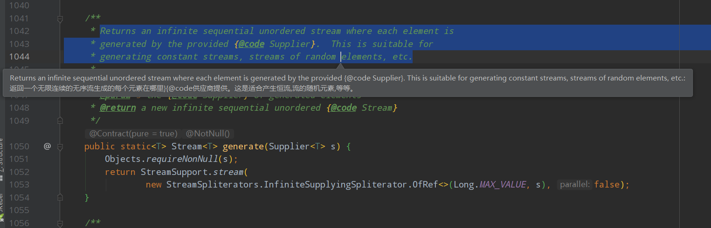

### 什么是函数式接口

`函数式接口`指的是一个**有且仅有一个抽象方法**，但是**可以有多个非抽象方法**的接口，这样的接口可以隐式转换为 Lambda 表达式。

但是在实践中，函数式接口非常脆弱，只要某个开发者在该接口中添加一个函数，则该接口就不再是函数式接口进而导致编译失败。为了克服这种代码层面的脆弱性，并显式说明某个接口是函数式接口，Java 8 提供了一个特殊的注解`@FunctionalInterface`，举个简单的函数式接口的定义：

```java
@FunctionalInterface
public interface Function2 {

    /**
     * 有参数无返回值
     * @param msg
     */
    void call(String msg);
}
```

```java
Function2 f = new Function2() {
	@Override
	public void call(String msg) {
 		System.out.println(msg);
	}
};
 f.call("hello world!");
//java8通过lambda表达式编程：
Function2 f2 = (msg) -> System.out.println(msg);
f2.call("hahaha");
```

```
例子：java.lang.Runnable和java.util.concurrent.Callable
```


### `@FunctionalInterface`注解

Java 8为函数式接口引入了一个新注解`@FunctionalInterface`，主要用于**编译级错误检查**，加上该注解，当你写的接口不符合函数式接口定义的时候，编译器会报错。

**正确例子**，没有报错：

```java
@FunctionalInterface
public interface Function2 {

    /**
     * 有参数无返回值
     * @param msg
     */
    void call(String msg);
}
```

**错误例子**，接口中包含了两个抽象方法，违反了函数式接口的定义，报错提示其不是函数式接口。


**提醒：加不加`@FunctionalInterface`对于接口是不是函数式接口没有影响，该注解知识提醒编译器去检查该接口是否仅包含一个抽象方法。**

### 四大函数式接口

#### Function接口

##### 介绍

【有参数，有返回值】


从Function接口的源代码，我们可以看出，`JDK1.8`之后才加入这个接口。`Functional`接口类中只有一个抽象方法待实现，符合函数式接口(指的是一个**有且仅有一个抽象方法**，但是**可以有多个非抽象方法**的接口)，因此Function接口可以用Lambda表达式——这个方法就是apply。

从源码可以看出，**入参和出参类型，用泛型动态指定。apply的具体逻辑就相当于是入参转化为出参的具体逻辑。也就相当于是y = f(x)这个里面的，映射法则f。具体逻辑需要我们用匿名内部类或者Lambda，写方法体来实现**。因此这个接口又叫`函数型接口`。

##### 示例

```java
   @Test
    public void testFunction() {

        // 如果入参为null，则回参为0，否则返回入参的值作为出参
        Function<Integer,Integer> fun1 = (s1) -> s1 != null ? s1 : 0;
        Integer apply = fun1.apply(3);//3
        Integer apply3 = fun1.apply(null);//0
        System.out.println(apply); //3
        // 将入参的值+1后作为回参返回
        Function<Integer,Integer> fun2 = s1 -> s1 + 1;
        Integer res2 = fun2.apply(2);//3

        // andThen是先执行前面的操作，然后执行andThen之后的操作
        Function<Integer, Integer> fun3 = fun1.andThen(fun2);
        Integer apply1 = fun3.apply(4);//5

        //identity() 总是返回传入的对象
        Function<Integer, Integer> identity = Function.identity();
        Integer apply2 = identity.apply(1); //1

    }
```

我们可以使用Function接口来将同一个方法的处理逻辑抽象出来，在调用方法的时候，将处理逻辑以Lambda表达式的形式传入，实现同一个方法可以处理不同的代码逻辑，而且使用泛型来表示方法的出入参，可以避免不必要的类型转换和异常发生。

##### Function在jdk中的应用

在JDK1.8中的新属性Stream中，就使用到了Function接口，看下面的源码：


示例：

```java
@Test
    public void testFunction1() {
        User zyj1 = new User("zyj1", "1001", "aa@cc.com", "110");
        User zyj2 = new User("zyj2", "1002", "aa1@cc.com", "111");
        User zyj3 = new User("zyj3", "1003", "aa2@cc.com", "112");
        User zyj4 = new User("zyj4", "1004", "aa3@cc.com", "113");
        User zyj5 = new User("zyj5", "1005", "aa4@cc.com", "114");
        List<User> users = Arrays.asList(zyj1, zyj2, zyj3, zyj4, zyj5);
        List<String> userNos = users.stream().map(user -> {
            return user.getUserNo();
        }).collect(Collectors.toList());
        System.out.println(userNos);
    }
```

#### Consumer接口

##### 什么是Consumer接口？

【有参数，无返回值】


从源码可以看出，Consumer与Function类似，只有一个accept抽象方法待实现，只不过唯一的区别是，Consumer的accept使用void修饰，没有返回值，而Function有返回值。

Consumer接口又称为 消费型接口，顾名思义，入参传入后，被accept方法消费掉了，什么都没得到。

##### 示例

```java
    public static void main(String[] args) {
        Consumer<Object> consumer1 = new Consumer<Object>() {
            @Override
            public void accept(Object o) {
                System.out.println("这次消费了:" + o.toString());
            }
        };

        consumer1.accept("100w元在双十一！这下穷死了！");

        Consumer<String> consumer2 = s -> System.out.println("这次消费了:" + s);

        consumer2.accept("120w元在双十二！又穷死了！");
    }

```

提取公共方法为

```java
public class ConsumerTest<T> {

    public static void main(String[] args) {
        ConsumerTest<String> consumerTest = new ConsumerTest<>();
        consumerTest.accept("100w元在双十一！这下穷死了！", s -> System.out.println("这次消费了:" + s));
        consumerTest.accept("120w元在双十二！又穷死了！", s -> System.out.println("这次消费了:" + s));
    }

    public void accept(T in, Consumer<? super T> consumer) {
        consumer.accept(in);
    }
}
```

##### Consumer接口在JDK中的应用


示例：

```java
 	@Test
    public void testFunction2() {
        List<Integer> users = Arrays.asList(1, 2, 3, 4, 5);
        users.stream().forEach(item->{
            System.out.println(item);
        });
        List<Integer> res = users.stream().peek(item -> {
            System.out.println(item);
        }).map(item -> item + 1).collect(Collectors.toList());
        System.out.println("res="+res);
    }
```

#### Suppiler接口

##### 什么是Suppiler接口？

【无参数，有返回值】

既然我们上面说到了Consumer为`消费型接口`，按照惯例，那肯定有`生产型接口`或者也可以成为`供给型接口`——Supplier接口，看下图源码：


##### Supplier接口在JDK中的应用



`generate`方法返回一个无限连续的无序流，其中每个元素由提供的供应商(`Supplier`)生成。`generate`方法用于生成常量流和随机元素流。看下面例子：

```java
public static void main(String[] args) {

        // 生成随机数
        Stream.generate(() -> new Random().nextInt(10));
        stream.forEach(System.out::println);

        // 生成随机布尔流
        Stream.generate(() -> new Random().nextBoolean())
                .forEach(System.out::println);

        // 生成常量流
        Stream.generate(() -> "Hello World!")
                .forEach(System.out::println);
    }
```

执行结果：

```java
2
5
1
--- #略

true
false
true
--- #略

Hello World!
Hello World!
Hello World!
--- #略
```

由于`generate`返回无限连续流，为了限制流中元素的数量，我们可以使用`Stream.limit`方法

```java
 public static void main(String[] args) {
	Stream.generate(() -> new Random().nextInt(10)).limit(3)
	   .forEach(e -> System.out.println(e));
	
	Stream.generate(() -> new Random().nextBoolean()).limit(3)
	   .forEach(e -> System.out.println(e));
	
	Stream.generate(() -> "Hello World!").limit(3)
	   .forEach(e -> System.out.println(e));
  }
```

执行结果：

```
3
6
3
true
false
false
Hello World!
Hello World!
Hello World!
```

#### Predicate接口

##### 什么是Predicate接口？


Predicate接口又称为`断言型接口`，test()方法有参但是返回值类型是固定的boolean，看下面例子：

```java
 @Test
    public void testPredicate() {
            Predicate<String> predicate = (s) -> s.length() > 0;
            // 测试字符串的长度是否>0
            System.out.println(predicate.test("hello"));//true
            // 结果取反
            System.out.println(predicate.negate().test("hello"));//false
            System.out.println("=====or / and======");
            System.out.println(predicate.test(""));//false
            // 增加或判断，二者满足其一则为true
            System.out.println(predicate.or(s -> s.equals("")).test(""));//true
            // 增加与判断，二者都满足则为true
            System.out.println(predicate.and(s -> s.equals("hello")).test(""));//false
            System.out.println(predicate.and(s -> s.equals("hello")).test("hello"));//true

            System.out.println("=====isEqual======");
            // 判断是否相等
            System.out.println(Predicate.isEqual("hello").test(""));//false
            System.out.println(Predicate.isEqual("hello").test("hello"));//true
    }
```

##### Predicate接口在JDK中的应用


例子：

```java
@Test
    public void test22() {
        List<Integer> nums = Arrays.asList(1, 2, 3, 4, 5, 66, 73, -1);
        nums.stream().filter(item->{
            return item < 20;
        }).forEach(System.out::println);

    }
```

