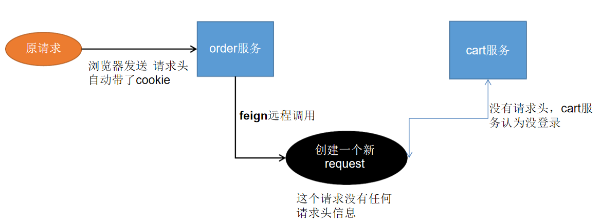
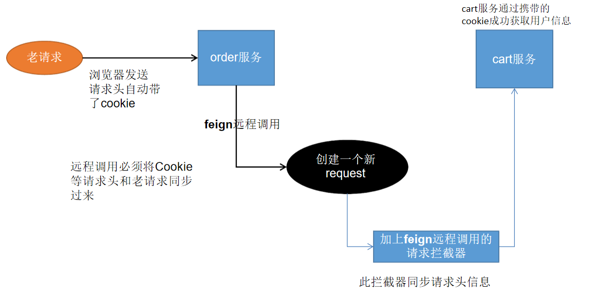
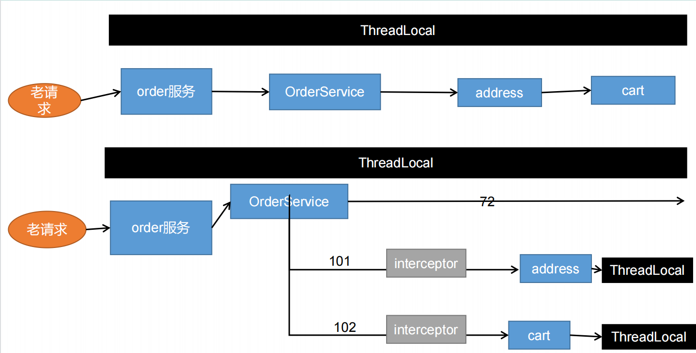

## feign进行远程调用丢失请求头问题

### 问题：feign进行远程调用丢失请求头



### 原因：

feign在进行远程调用时会构建建一个新的request对象

[OpenFeign 的架构原理](https://zhuanlan.zhihu.com/p/457256778)

### 解决：

自定义一个feign的拦截器，同步请求头信息



### 核心代码：

```java
@Configuration
public class MyFeignInterceptor {

    @Bean("requestInterceptor")
    public RequestInterceptor requestInterceptor() {

        RequestInterceptor requestInterceptor = new RequestInterceptor() {
            @Override
            public void apply(RequestTemplate template) {
                //1、使用RequestContextHolder拿到请求数据
                ServletRequestAttributes requestAttributes = (ServletRequestAttributes) RequestContextHolder.getRequestAttributes();

                if (requestAttributes != null) {
                    //老请求
                    HttpServletRequest request = requestAttributes.getRequest();
                    if (request != null) {
                        //2、同步请求头的数据（主要是cookie）
                        //把老请求的cookie值放到新请求上，进行一个同步
                        String cookie = request.getHeader("Cookie");
                        template.header("Cookie", cookie);
                        //同步所有的
                        /*Enumeration<String> headerNames = request.getHeaderNames();
                    	while (headerNames.hasMoreElements()) {
                       		String name = headerNames.nextElement();
                        	String value = request.getHeader(name);
                       		template.header(name,value);
                   		}*/
                    }
                }
            }
        };
        return requestInterceptor;
    }
}
```

## Feign异步情况丢失上下文问题



### 解决：

```java
//获取当前线程请求头信息 (解决Feign异步调用丢失请求头问题)
RequestAttributes requestAttributes = RequestContextHolder.getRequestAttributes();

//开启第一个异步任务
CompletableFuture<Void> addressFuture = CompletableFuture.runAsync(() -> {

    //每一个线程都来共享之前的请求数据
    RequestContextHolder.setRequestAttributes(requestAttributes);

    //业务操作
    ...........
}, threadPoolExecutor);
```
