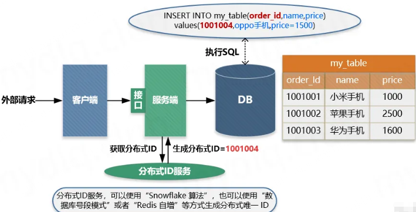
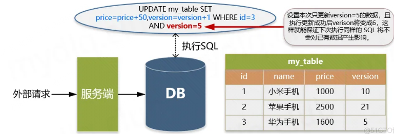
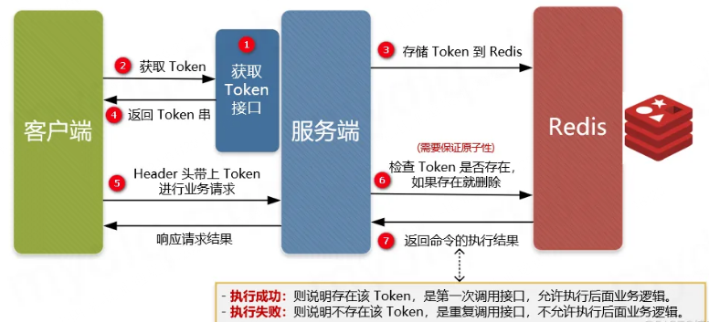
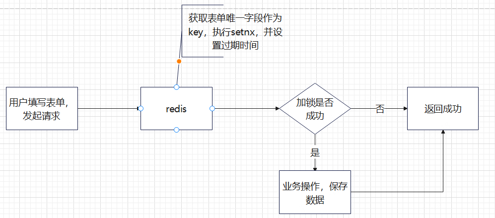

## 保证java接口幂等性介绍

### 一、什么是幂等性

幂等是一个数学与计算机学概念，在数学中某一元运算为幂等时，其作用在任一元素两次后会和其作用一次的结果相同。在计算机中编程中，一个幂等操作的特点是其任意多次执行所产生的影响均与一次执行的影响相同。

幂等函数或幂等方法是指可以使用相同参数重复执行，并能获得相同结果的函数。这些函数不会影响系统状态，也不用担心重复执行会对系统造成改变。

### 二、什么是接口幂等性

在HTTP/1.1中，对幂等性进行了定义。它描述了一次和多次请求某一个资源对于资源本身应该具有同样的结果（网络超时等问题除外），即第一次请求的时候对资源产生了副作用，但是以后的多次请求都不会再对资源产生副作用。

这里的副作用是不会对结果产生破坏或者产生不可预料的结果。也就是说，其任意多次执行对资源本身所产生的影响均与一次执行的影响相同。

### 三、为什么需要实现幂等性

在接口调用时一般情况下都能正常返回信息不会重复提交，不过在遇见以下情况时可以就会出现问题，如：

①、**前端重复提交表单**： 在填写一些表格时候，用户填写完成提交，很多时候会因网络波动没有及时对用户做出提交成功响应，致使用户认为没有成功提交，然后一直点提交按钮，这时就会发生重复提交表单请求。

②、**用户恶意进行刷单：** 例如在实现用户投票这种功能时，如果用户针对一个用户进行重复提交投票，这样会导致接口接收到用户重复提交的投票信息，这样会使投票结果与事实严重不符。

③、**接口超时重复提交：** 很多时候 HTTP 客户端工具都默认开启超时重试的机制，尤其是第三方调用接口时候，为了防止网络波动超时等造成的请求失败，都会添加重试机制，导致一个请求提交多次。

④、**消息进行重复消费：** 当使用 MQ 消息中间件时候，如果发生消息中间件出现错误未及时提交消费信息，导致发生重复消费。

使用幂等性最大的优势在于使接口保证任何幂等性操作，免去因重试等造成系统产生的未知的问题。

### 四、引入幂等性后对系统的影响

幂等性是为了简化客户端逻辑处理，能放置重复提交等操作，但却增加了服务端的逻辑复杂性和成本，其主要是：

把并行执行的功能改为串行执行，降低了执行效率。

增加了额外控制幂等的业务逻辑，复杂化了业务功能

所以在使用时候需要考虑是否引入幂等性的必要性，根据实际业务场景具体分析，除了业务上的特殊要求外，一般情况下不需要引入的接口幂等性。

### 五、Restfull API接口的幂等性

现在流行的  Restful 推荐的几种 HTTP 接口方法中，分别存在幂等与不能保证幂等的方法，如下：

> 满足幂等：√  ；不满足幂等： × ；可能满足也可能不满足幂等，根据实际业务逻辑有关： \-  ；

| 方法类型 | 是否幂等 | 描述                                                         |
| -------- | :------- | ------------------------------------------------------------ |
| GET      | √        | Get请求一般用于获取资源。不会也不应该对系统资源进行改变，所以是幂等的 |
| POST     | ×        | Post请求一般用于创建新的资源。其每次执行都会新增数据，所以不是幂等的 |
| PUT      | -        | Put请求一般用于修改资源。该操作则分情况来判断是不是满足幂等。更新操作中直接根据某个值进行更新，也能保证幂等。不过执行累加操作的更新是非幂等的 |
| DELETE   | -        | Delete方法一般用于删除资源。该操作也许要分情况来判断是不是满足幂等，当根据唯一值进行删除时，删除同一个数据 多次执行效果一样。不过需要注意，带查询条件的删除则就不一定满足幂等了。例如在根据条件进行删除后，这是新增加了一条数据A 满足查询条件，然后又执行了一次删除，那么将会导致新增加的这条满足条件的数据A 也被删除了 |
|          |          |                                                              |

### 六、如何实现幂等性

#### 方案一：数据库唯一主键

数据库唯一主键的实现主要是利用数据库中主键唯一约束的特性，一般来说唯一主键比较适用于“插入”时的幂等性，其能保证一张表中只能存在一条带该唯一主键的记录。

使用数据库唯一主键完成幂等性时需要注意的是，**该主键一般来说并不是使用数据库中自增主键，而是使用分布式 ID** 充当主键，这样才能能保证在分布式环境下 ID 的全局唯一性。

**适用：**插入、删除操作

**使用限制：**需要生成全局唯一ID

**主要流程：**



① 客户端执行创建请求，调用服务端接口。

② 服务端执行业务逻辑，生成一个分布式 ID，将该 ID 充当待插入数据的主键，然后执数据插入操作，运行对应的 SQL 语句。

③ 服务端将该条数据插入数据库中，如果插入成功则表示没有重复调用接口。如果抛出主键重复异常，则表示数据库中已经存在该条记录，返回错误信息到客户端。

#### 方案二：数据库乐观锁

数据库乐观锁方案一般只能适用于执行“更新操作”的过程，我们可以提前在对应的数据表中多添加一个字段，充当当前数据的版本标识。这样每次对该数据库该表的这条数据执行更新时，都会将该版本标识作为一个条件，值为上次待更新数据中的版本标识的值。

**适用：**更新操作

**使用限制：**需要在数据库业务表中增加额外字段

**主要流程：**



为了每次执行更新时防止重复更新，确定更新的一定是要更新的内容，我们通常都会添加一个 version 字段记录当前的记录版本，这样在更新时候将该值带上，那么只要执行更新操作就能确定一定更新的是某个对应版本下的信息。这样每次执行更新时候，都要指定要更新的版本号，如下操作就能准确更新 version=5 的信息：

```sql
UPDATE my_table SET price=price+50,version=version+1 WHERE id=1 AND version=5
```

上面 WHERE 后面跟着条件 id=1 AND version=5 被执行后，id=1 的 version 被更新为 6，所以如果重复执行该条 SQL 语句将不生效，因为 id=1 AND version=5 的数据已经不存在，这样就能保住更新的幂等，多次更新对结果不会产生影响。

#### 方案三、防重Token令牌

针对客户端连续点击或者调用方的超时重试等情况，例如提交订单，此种操作就可以用 Token 的机制实现防止重复提交。

简单的说就是调用方在调用接口的时候先向后端请求一个全局 ID（Token），请求的时候携带这个全局 ID 一起请求（Token 最好将其放到 Headers 中），后端需要对这个 Token 作为 Key，用户信息作为 Value 到 Redis 中进行键值内容校验，如果 Key 存在且 Value 匹配就执行删除命令，然后正常执行后面的业务逻辑。如果不存在对应的 Key 或 Value 不匹配就返回重复执行的错误信息，这样来保证幂等操作。

**适用：**插入、更新、删除操作

**使用限制：**需要生成全局唯一Token；需要使用第三方组件Redis进行数据校验；

**主要流程：**



① 服务端提供获取 Token 的接口，该 Token 可以是一个序列号，也可以是一个分布式 ID 或者 UUID 串。

② 客户端调用接口获取 Token，这时候服务端会生成一个 Token 串。

③ 然后将该串存入 Redis 数据库中，以该 Token 作为 Redis 的键（注意设置过期时间）。

④ 将 Token 返回到客户端，客户端拿到后应存到表单隐藏域中。

⑤ 客户端在执行提交表单时，把 Token 存入到 Headers 中，执行业务请求带上该 Headers。

⑥ 服务端接收到请求后从 Headers 中拿到 Token，然后根据 Token 到 Redis 中查找该 key 是否存在。

⑦ 服务端根据 Redis 中是否存该 key 进行判断，如果存在就将该 key 删除，然后正常执行业务逻辑。如果不存在就抛异常，返回重复提交的错误信息。

> 注意：在并发情况下，执行 Redis 查找数据与删除需要保证原子性，否则很可能在并发下无法保证幂等性。其实现方法可以使用分布式锁或者使用 Lua 表达式来注销查询与删除操作。


#### 方案4：分布式锁

1、使用Redis的`setNx`命令实现接口幂等性

2、使用Redisson来加锁

> `SETNX key value`：当且仅当`key`不存在时将`key`的值设为`value`;若给定的`key`已经存在，则`SETNX`不做任何动作。设置成功时返回`1`，否则返回`0`。

主要流程：

1、客户端先请求服务端，会拿到一个能代表这次请求业务的唯一字段;

2、将该字段以`SETNX`的方式存入`Redis`中，并根据业务设置相应的超时时间;

3、如果设置成功，证明这是第一次请求，则执行后续的业务逻辑;

4、如果设置失败，则代表已经执行过当前请求，直接返回成功。



> 需要特别注意的是：分布式锁一定要设置一个合理的过期时间，如果设置过短，无法有效的防止重复请求。如果设置过长，可能会浪费`redis`的存储空间，需要根据实际业务情况而定。

### 七、实现幂等性示例

#### 方案3实现，

代码示例：

1、获取token

```java
@Autowired
StringRedisTemplate stringRedisTemplate;
/**
 *  这里的key根据具体的业务来设置，要保证是唯一的
 */
@GetMapping(/getToken)
public String getToken(String key) {
    String token = UUID.randomUUID().toString().replace("-", "");
	stringRedisTemplate.opsForValue().set(key,token,30, TimeUnit.MINUTES);
    return token;
}
```

2、验证令牌

```java
public void validateToken(String key ,String token) {
        //1、验证令牌 【令牌的对比和删除必须保证原子性】
        //执行结果 ： 0-验证失败 1-验证成功
        String script = "if redis.call('get', KEYS[1]) == ARGV[1] then return redis.call('del', KEYS[1]) else return 0 end";
        //原子验证令牌和删除令牌
        Long result = stringRedisTemplate.execute(
                new DefaultRedisScript<>(script,Long.class),
                Arrays.asList(key),
                token); 
    	if(result == 1L) {
            //验证成功
        } else if(result == 0) {
            //验证失败，返回异常提示信息。。。
        }
}

```

### 八、总结

幂等性应该在设计系统时，是首要考虑的一个问题，尤其是在像支付宝，银行，互联网金融公司等涉及的都是钱的系统，既要高效，数据也要准确，所以不能出现多扣款，多打款等问题，这样会很难处理，用户体验也不好。在实际开发中，我们需要针对不同的业务场景我们需要灵活的选择幂等性的实现方式

