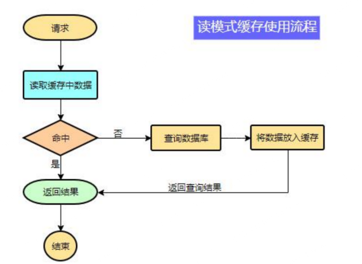
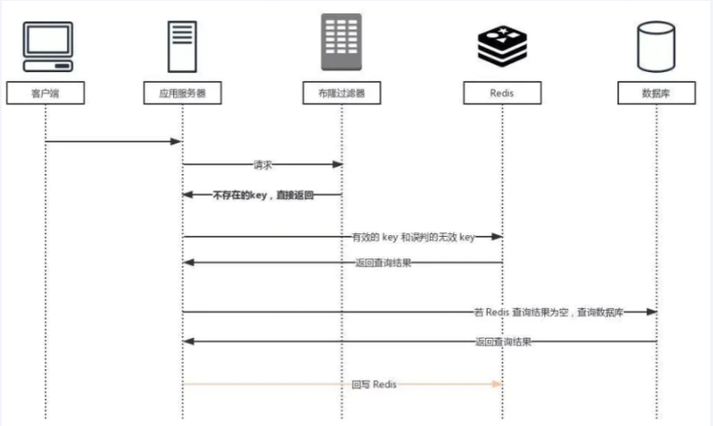
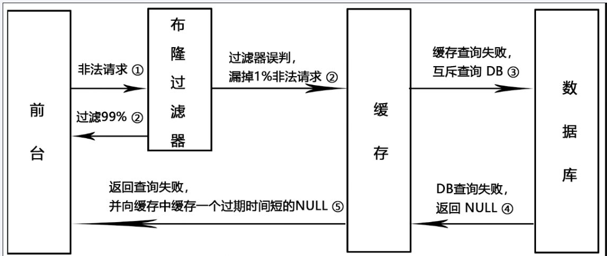
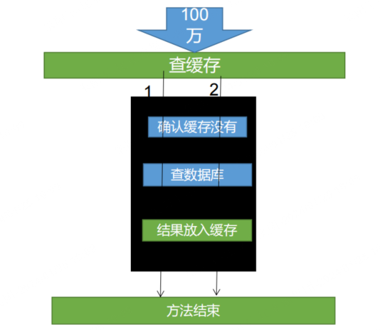
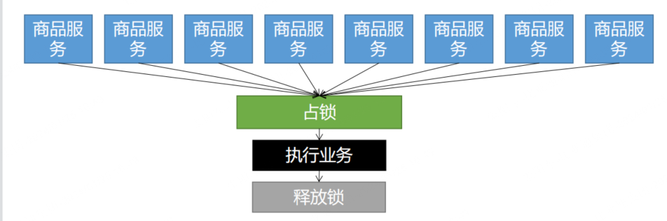
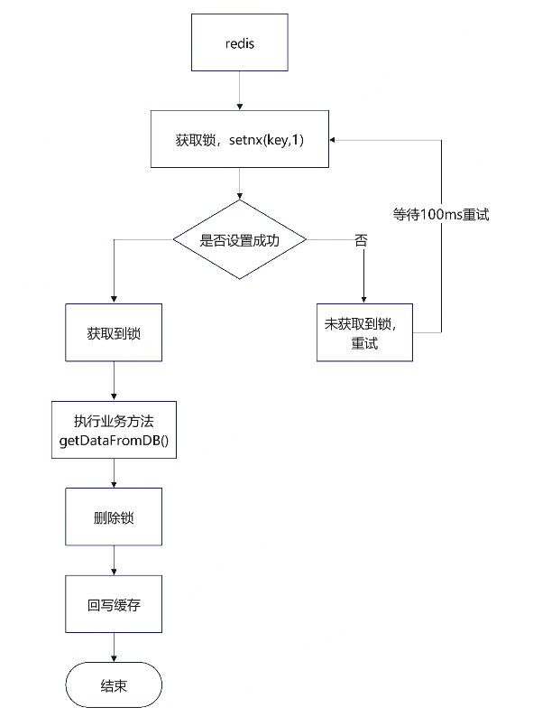
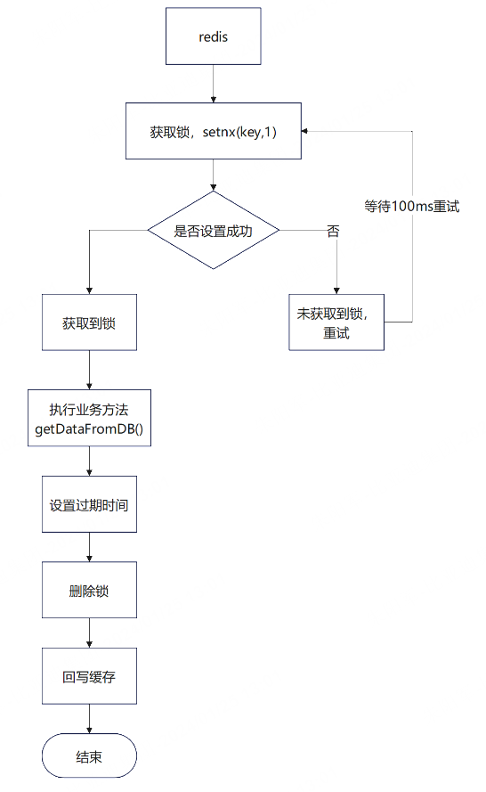
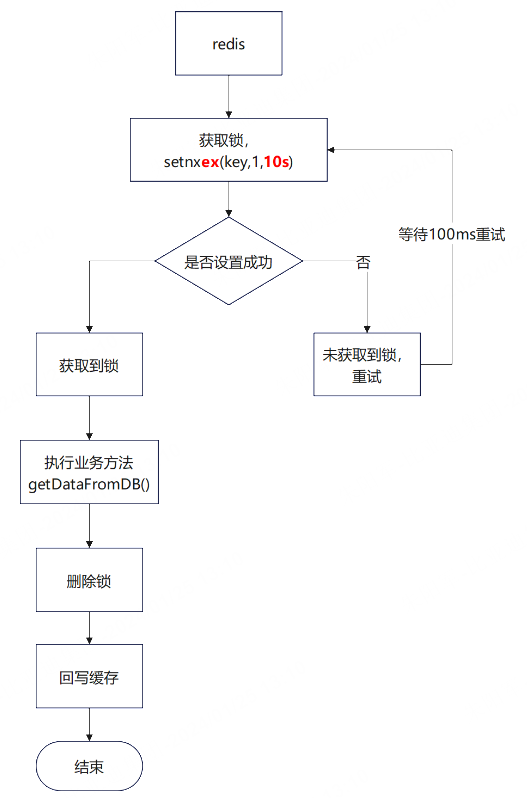
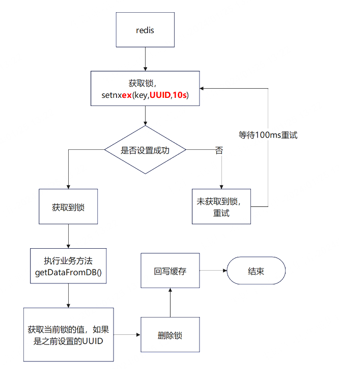
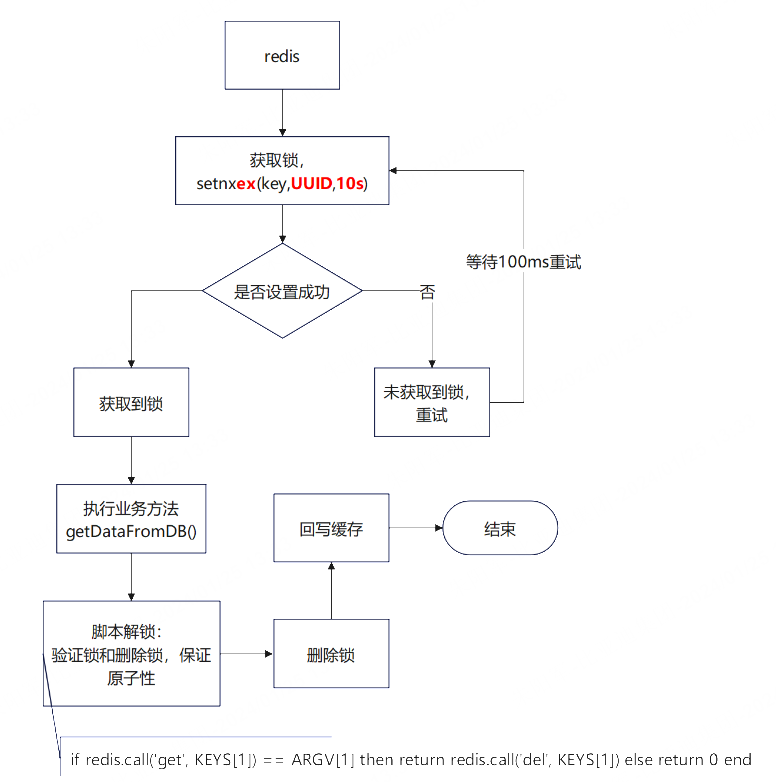

## 一、缓存

### 1、缓存的使用

为了系统性能的提升，我们一般都会将部分数据放入缓存中，加速访问。而 db 承担数据落盘工作。 

**哪些数据适合放入缓存？** 

**即时性、数据一致性要求不高的**、**访问量大且更新频率不高的数据（读多，写少）** 

举例：电商类应用，商品分类，商品列表等适合缓存并加一个失效时间(根据数据更新频率来定)，后台如果发布一个商品，买家需要 5 分钟才能看到新的商品一般还是可以接受的。



> **注意：**在开发中，凡是放入缓存中的数据我们都应该指定过期时间，使其可以在系统即使没有主动更新数据也能自动触发数据加载进缓存的流程。避免业务崩溃导致的数据永久不一致问题。

### 2、整合Redis作为缓存

①、引入依赖

```xml
<dependency>
    <groupId>org.springframework.boot</groupId>
    <artifactId>spring-boot-starter-data-redis</artifactId>
</dependency>
```

②、配置yaml

```yaml
spring: 
 redis:
  host: 192.168.56.10
  port: 6379
```

③、使用SpringBoot自动配置好的StringRedisTemplate来操作redis

```java
@Autowired StringRedisTemplate stringRedisTemplate; 
@Test
public void testStringRedisTemplate(){
    ValueOperations<String, String> ops = stringRedisTemplate.opsForValue();
    ops.set("hello","world_"+ UUID.randomUUID().toString()); 
    String hello = ops.get("hello");
    System.out.println(hello);
}
```

④、切换使用jedis

```java
 产生堆外内存溢出：OutOfDirectMemoryError
1)、springboot2.0之后默认使用lettuce作为操作redis的客户端，它使用netty进行网络通信
2)、lettuce的bug导致netty堆外内存溢出 -Xmx300m;netty如果没指定堆外内存，默认使用-Xmx300m
3) 可以通过-Did.netty.maxDirectMemory设置
解决方案：不能使用-Did.netty.maxDirectMemory只调大堆外内存
        1）、升级lettuce客户端
        2）、切换使用jedis
```

```xml
<!--        redis-->
        <dependency>
            <groupId>org.springframework.boot</groupId>
            <artifactId>spring-boot-starter-data-redis</artifactId>
<!--            切换jedis-->
            <exclusions>
                <exclusion>
                    <groupId>io.lettuce</groupId>
                    <artifactId>lettuce-core</artifactId>
                </exclusion>
            </exclusions>
        </dependency>
        <dependency>
            <groupId>redis.clients</groupId>
            <artifactId>jedis</artifactId>
        </dependency>
```

## 二、缓存失效问题

### 1、缓存雪崩

缓存雪崩是指在我们设置缓存时key采用了相同的过期时间或者Redis主机宕机， 导致缓存在某一时刻同时失效，请求全部转发到DB，DB瞬时压力过重雪崩。

`解决`：

- redis中key设置永不过期或过期时间错开：原有的失效时间基础上增加一个随机值，比如1-5分钟随机，这样每一个缓存的过期时间的重复率就会降低，就很难引发集体失效的事件。
- redis缓存集群实现高可用：【主从+哨兵】、【集群】、【开启Redis持久化机制aof/rdb，尽快恢复缓存集群】
- 服务降级：阿里Sentinel限流&降级

### 2、缓存穿透

**缓存穿透**是指**查询一个一定不存在的数据**，由于缓存是不命中，将去查询数据库，但是数据库也无此记录，我们没有将这次查询的 null 写入缓存，这将导致这个不存在的数据每次请求都要到存储层去查询，失去了缓存的意义。 

**在流量大时**，可能 DB 就挂掉了，要是有人利用不存在的 key 频繁攻击我们的应用，这就是漏洞。 

**`解决：`**

**①、空对象缓存或缺省值** 【ps：要添加过期时间】

此方法架不住黑客的恶意攻击，有缺陷......，只能解决key相同的情况

**②、使用谷歌的布隆过滤器Guava解决**

引入依赖：

```xml
<!--guava Google 开源的 Guava 中自带的布隆过滤器-->
        <dependency>
            <groupId>com.google.guava</groupId>
            <artifactId>guava</artifactId>
            <version>23.0</version>
        </dependency>
```

具体实现可以看Redis篇



**布隆过滤器说明：**



### 3、缓存击穿

#### 简介

对于一些设置了过期时间的key，如果这些key可能会在某些 时间点被超高并发地访问，是一种非常“热点”的数据。 

如果这个key在大量请求同时进来前正好失效，那么所有对这个key的数据查询都落到db，我们称为缓存击穿。

##### **`解决方案：`**

- 方式一：差异失效时间。对于频繁访问的热点key数据不设置过期时间

- 方式二：互斥更新，采用双检加锁策略

  > 多个线程同时去查询数据库的这条数据，那么我们可以在第一个查询数据的请求上使用一个 互斥锁来锁住它。
  >
  > 其他的线程走到这一步拿不到锁就等着，等第一个线程查询到了数据，然后做缓存。后面的线程进来发现已经有缓存了，就直接走缓存。

#### 加锁时序：



#### 示例：

##### **本地锁**

`不使用于分布式系统`

```java
    public String get(String key) {
        //先查缓存
        String value = stringRedisTemplate.opsForValue().get(key);
        if(StringUtils.isNotBlank(value)) {
            //缓存存在直接返回
            return value;
        }
        //缓存不存在则对方法加锁
        synchronized (this) {
            //再差一次缓存
            value = stringRedisTemplate.opsForValue().get(key);
            if(StringUtils.isNotBlank(value)) {
                //缓存存在直接返回
                return value;
            }
            //二次查询缓存也不存在，直接查DB
            value = dao.get(key);
            //把查出来的数据放到缓存里，加上过期时间
            stringRedisTemplate.opsForValue().setIfAbsent(key,value,time);
            return value;
        }
    }
```

##### **分布式锁实现**

## 三、分布式锁演进

### **基本原理**



我们可以同时去一个地方“占坑”，如果占到，就执行逻辑。否则就必须等待，直到释放锁。 

“占坑”可以去redis，可以去数据库，可以去任何大家都能访问的地方。 

等待可以**自旋**的方式

###  **`getDataFromDB()`**

```java
public String getDataFromDB(String key){
        //得到锁以后，要再去缓存中查一次，如果没有才查db
        String value = stringRedisTemplate.opsForValue().get(key);
        if(StringUtils.isNotBlank(value)) {
            //缓存不为空直接返回
            return value;
        }
        //执行业务代码，查询数据库
     	value = dao.get(key);
        //将查到的数据放到缓存中
        stringRedisTemplate.opsForValue().set(key, value,3, TimeUnit.DAYS);
        return value;
    }
```

### 阶段一

#### 流程图



#### 实现

```java
/**
 * 分布式锁——阶段一
 * @return
 */
public String getValue1(String dataKey) {
    String lockKey = "lock";
    Boolean lock = stringRedisTemplate.opsForValue().setIfAbsent(lockKey, "1");
    if(lock) {
        //加锁成功，执行业务
        String dataFromDB = getDataFromDB(dataKey);
        //删除锁
        stringRedisTemplate.delete(lockKey);
        return dataFromDB;
    } else {
        //加锁失败，重试
        //休眠100m重试
        try { TimeUnit.MILLISECONDS.sleep(100); } catch (InterruptedException e) { e.printStackTrace(); }
        //自旋的方式
        return getValue1(dataKey);
    }
}
```

#### 问题

setnx占好了位，业务代码异常或者程序在页面过程中宕机。没有执行删除锁逻辑，这就造成了**死锁** 

#### **解决：** 

设置锁的自动过期，即使没有删除，会自动删除。`===>阶段二`

### 阶段二

#### 流程图



#### 实现

```java
/**
 * 分布式锁——阶段二
 * @return
 */
public String getValue2(String dataKey) {
    String lockKey = "lock";
    Boolean lock = stringRedisTemplate.opsForValue().setIfAbsent(lockKey, "1");
    if(lock) {
        //加锁成功，执行业务
        //设置过期时间
        stringRedisTemplate.expire(lockKey,30,TimeUnit.SECONDS)
        String dataFromDB = getDataFromDB(dataKey);
        //删除锁
        stringRedisTemplate.delete(lockKey);
        return dataFromDB;
    } else {
        //加锁失败，重试
        //休眠100m重试
        try { TimeUnit.MILLISECONDS.sleep(100); } catch (InterruptedException e) { e.printStackTrace(); }
        //自旋的方式
        return getValue2(dataKey);
    }
}
```

#### 问题

setnx设置好，正要去设置过期时间，宕机。又死锁了。

#### 解决

设置过期时间和占位必须是原子的。redis支持使用setnx ex 命令    `====>阶段3`

### 阶段三

#### 流程图



#### 实现

```java
/**
 * 分布式锁——阶段三
 * @return
 */
public String getValue3(String dataKey) {
    String lockKey = "lock";
    Boolean lock = stringRedisTemplate.opsForValue().setIfAbsent(lockKey, "1",10,TimeUnit.SECONDS);
    if(lock) {
        //加锁成功，执行业务
        //设置过期时间
        stringRedisTemplate.expire(lockKey,30,TimeUnit.SECONDS)
        String dataFromDB = getDataFromDB(dataKey);
        //删除锁
        stringRedisTemplate.delete(lockKey);
        return dataFromDB;
    } else {
        //加锁失败，重试
        //休眠100m重试
        try { TimeUnit.MILLISECONDS.sleep(100); } catch (InterruptedException e) { e.printStackTrace(); }
        //自旋的方式
        return getValue3(dataKey);
    }
}
```

#### 问题

如果由于业务时间很长，锁自己过期了，我们直接删除，有可能把别人正在持有的锁删除了。 

#### 解决

占锁的时候，值指定为`uuid`，每个人匹配是自己的锁才删除。`====>阶段4`

### 阶段四

#### 流程图



#### 实现

```java
/**
 * 分布式锁——阶段四
 * @return
 */
public String getValue4(String dataKey) {
    String uuid = UUID.randomUUID().toString();
    String lockKey = "lock";
    Boolean lock = stringRedisTemplate.opsForValue().setIfAbsent(lockKey,uuid,10,TimeUnit.SECONDS);
    if(lock) {
        //加锁成功，执行业务
        //设置过期时间
        stringRedisTemplate.expire(lockKey,30,TimeUnit.SECONDS)
        String dataFromDB = getDataFromDB(dataKey);

        //先去redis查询下保证当前的锁是自己的。下面不能保证原子性。
        String value = stringRedisTemplate.opsForValue().get(lockKey);
        if(StringUtils.equals(value,uuid)) {
            //删除锁
        	stringRedisTemplate.delete(lockKey);
        }
        return dataFromDB;
    } else {
        //加锁失败，重试
        //休眠100m重试
        try { TimeUnit.MILLISECONDS.sleep(100); } catch (InterruptedException e) { e.printStackTrace(); }
        //自旋的方式
        return getValue4(dataKey);
    }
}
```

#### 问题

如果正好判断是当前值，正要删除锁的时候，锁已经过期， 别人已经设置到了新的值。那么我们删除的是别人的锁

#### 解决

验证锁和删除锁的操作必须保证原子性。使用redis+Lua脚本完成。`====>阶段五，最终版本`

### 阶段五

#### 流程图



**lua脚本：**

`if redis.call('get', KEYS[1]) == ARGV[1] then return redis.call('del', KEYS[1]) else return 0 end`

#### 实现

```java
/**
 * 分布式锁——阶段五
 * @return
 */
public String getValue5(String dataKey) {
    String uuid = UUID.randomUUID().toString();
    String lockKey = "lock";
    Boolean lock = stringRedisTemplate.opsForValue().setIfAbsent(lockKey,uuid,10,TimeUnit.SECONDS);
    if(lock) {
        //加锁成功，执行业务
        //设置过期时间
        stringRedisTemplate.expire(lockKey,30,TimeUnit.SECONDS)
        String dataFromDB = getDataFromDB(dataKey);
        try {
        	dataFromDB = getDataFromDB();
        } finally {
		//获取值对比，对比成功删除=原子性 lua脚本解锁
        	String script = "if redis.call('get',KEYS[1]) == ARGV[1] then return redis.call('del',KEYS[1]) else return 0 end";
                //new DefaultRedisScript<Long>(script,Long.class) 这个泛型是返回值类型
                //删除锁
            Long res = stringRedisTemplate.execute(new DefaultRedisScript<Long>(script, Long.class), Arrays.asList(lockKey), uuid);
         }
        return dataFromDB;
    } else {
        //加锁失败，重试
        //休眠100m重试
        try { TimeUnit.MILLISECONDS.sleep(100); } catch (InterruptedException e) { e.printStackTrace(); }
        //自旋的方式
        return getValue5(dataKey);
    }
}
```

#### 问题

保证加锁【占位+过期时间】和删除锁【判断+删除】的原子性。 

更难的事情，锁的自动续期

#### 解决

使用Redisson ====》

### Redisson实现分布式锁

#### 实现

```java
public Map<String, List<Catelog2Vo>> getCatalogJson2() {
	//加入缓存逻辑，缓存中的数据是json字符串,
	//JSON跨语言跨平台兼容
    String catalogJSON = stringRedisTemplate.opsForValue().get("catalogJSON");
    if(StringUtils.isBlank(catalogJSON)){
    	//2、缓存中没有，查询数据库
    	Map<String, List<Catelog2Vo>> catalogJsonFromDb = getCatalogJsonFromDbWithRedissonLock();
        //3、将查到的数据放到缓存中,将对象转为json放到缓存中
        stringRedisTemplate.opsForValue().set("catalogJSON", JSON.toJSONString(catalogJsonFromDb),1, TimeUnit.DAYS);
        return catalogJsonFromDb;
	}
    //缓存命中，直接返回
    //转为指定的对象
    Map<String, List<Catelog2Vo>> res = JSON.parseObject(catalogJSON, new TypeReference<Map<String, List<Catelog2Vo>>>() {});
    return res;
}
	/**
     * 从数据库查询并封装数据
     * redisson
     *
     * 缓存里面的数据如何和数据库保持一致
     * 缓存数据一致性
     * 1)、双写模式
     * 2)、失效模式
     * @return
     */
    public Map<String, List<Catelog2Vo>> getCatalogJsonFromDbWithRedissonLock() {
        //注意锁的名字。锁的粒度，越细越快。
        //锁的粒度：约定：具体缓存的是某个数据，11-号商品：product-11-lock
        RLock lock = redissonClient.getLock("lock-redisson-catalog");
        lock.lock();
        log.info("获取分布式锁成功。。。。。");
        //加锁成功
        Map<String, List<Catelog2Vo>> dataFromDB = new HashMap<>();
        try {
            dataFromDB = getDataFromDB();
        } finally {
            //删除锁
            lock.unlock();
        }
        return dataFromDB;
    }
```

