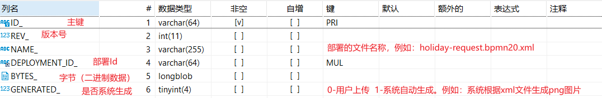
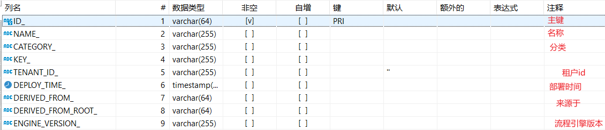
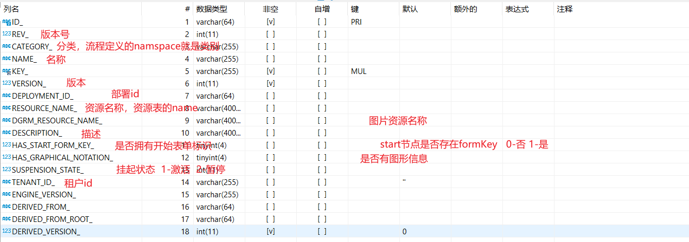
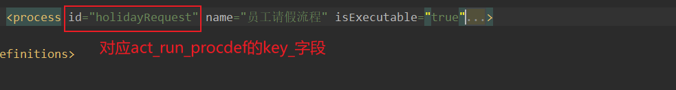
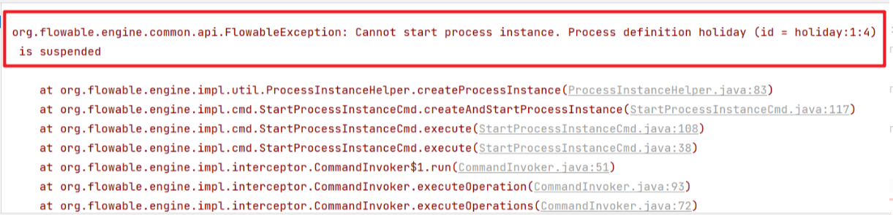
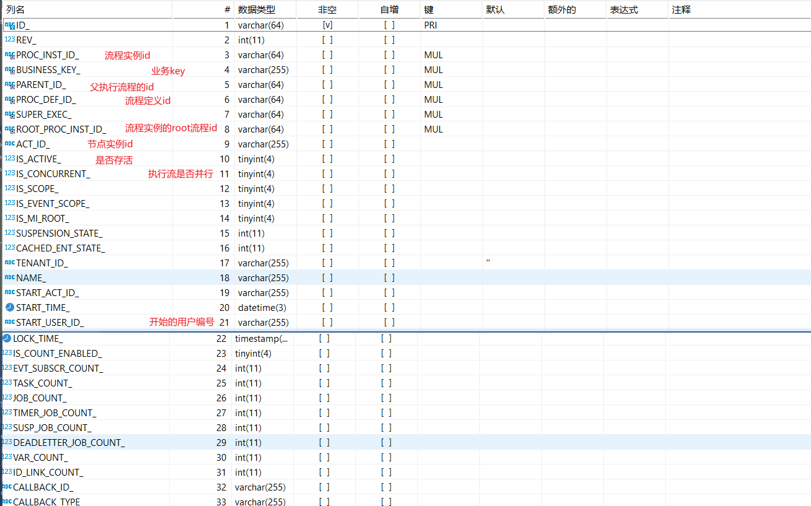
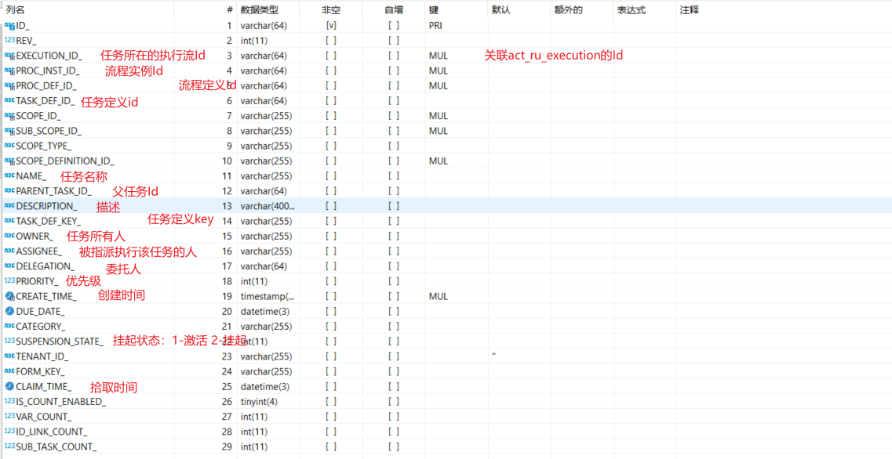
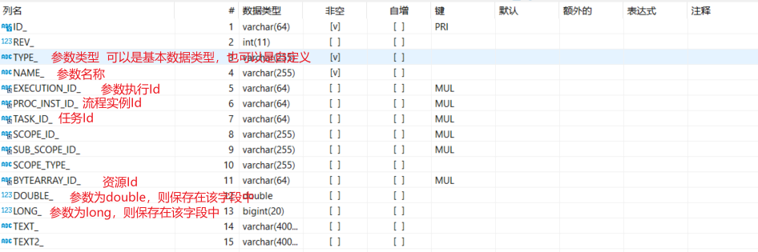
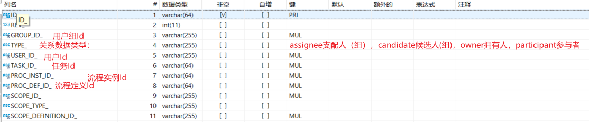
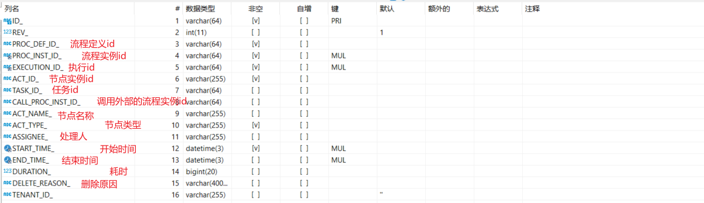

## flowable表结构

### 一、表结构详解

表的sql文件：`flowable-engine-6.3.0.jar!  \org\flowable\db\create\flowable.mysql.create.engine.sql`

工作流程的相关操作都是操作存储在对应的表结构中，为了能更好的弄清楚flowable的实现原理和细节，我们有必要先弄清楚Flowable的相关表结构及其作用。在Flowable中的表结构在初始化的时候会创建五类表结构，具体如下：

#### 1、ACT_RE_*

`RE`表示` repository`。 这个前缀的表包含了流程定义和流程静态资源 （图片，规则，等等）。

#### 2、ACT_RU_*

`RU`表示 `runtime`。 这些运行时的表，包含流程实例，任务，变量，异步任务等运行中的数据。 Flowable**只在流程实例执行过程中**保存这些数据， 在流程结束时就会删除这些记录。 这样运行时表可以一直很小速度很快。

#### 3、ACT_HI_*

`HI`表示 `history`。 这些表包含历史数据，比如历史流程实例， 变量，任务等等。

#### 4、ACT_GE_*

` GE` 表示 `general`。 通用数据， 用于不同场景下

#### 5、ACT_ID_*

`ID`表示`identity`(组织机构)。这些表包含标识的信息，如用户，用户组，等等。

具体的表结构的含义:

| 表分类                   | 表名                  | 解释                                               |
| ------------------------ | --------------------- | -------------------------------------------------- |
| ACT_GE_*（ 一般数据）    |                       |                                                    |
|                          | act_ge_bytearray      | 通用的流程定义和流程资源                           |
|                          | act_ge_property       | 系统相关属性                                       |
| ACT_HI_*（流程历史记录） |                       |                                                    |
|                          | act_hi_actinst        | 历史的流程实例                                     |
|                          | act_hi_attachment     | 历史的流程附件                                     |
|                          | act_hi_comment        | 历史的说明性信息                                   |
|                          | act_hi_detail         | 历史的流程运行中的细节信息                         |
|                          | act_hi_identitylink   | 历史的流程运行过程中用户关系                       |
|                          | act_hi_procinst       | 历史的流程实例                                     |
|                          | act_hi_taskinst       | 历史的任务实例                                     |
|                          | act_hi_varinst        | 历史的流程运行中的变量信息                         |
| ACT_RE_*（流程定义表）   |                       |                                                    |
|                          | act_re_deployment     | 部署单元信息                                       |
|                          | act_re_model          | 模型信息                                           |
|                          | act_re_procdef        | 已部署的流程定义                                   |
| ACT_RU_*（运行实例表）   |                       |                                                    |
|                          | act_ru_deadletter_job |                                                    |
|                          | act_ru_event_subscr   | 运行时事件                                         |
|                          | act_ru_execution      | 运行时流程执行实例                                 |
|                          | act_ru_history_job    |                                                    |
|                          | act_ru_identitylink   | 运行时用户关系信息，存储任务节点与参与者的相关信息 |
|                          | act_ru_job            | 运行时作业                                         |
|                          | act_ru_suspended_job  | 运行时挂起的作业                                   |
|                          | act_ru_task           | 运行时任务                                         |
|                          | act_ru_timer_job      |                                                    |
|                          | act_ru_variable       | 运行时变量表                                       |
| ACT_ID_*（用户用户组表） |                       |                                                    |
|                          | act_id_bytearray      | 二进制数据表                                       |
|                          | act_id_group          | 用户组信息表                                       |
|                          | act_id_info           | 用户信息详情表                                     |
|                          | act_id_membership     | 人与组关系表                                       |
|                          | act_id_priv           | 权限表                                             |
|                          | act_id_priv_mapping   | 用户或组权限关系表                                 |
|                          | act_id_property       | 属性表                                             |
|                          | act_id_token          | 记录用户的token信息                                |
|                          | act_id_user           | 用户表                                             |


### 二、部署流程相关表介绍

#### 1、部署

```java
	/**
     * 部署流程
     */
    @Test
    public void testDeploy() {
        //1、获取流程引擎processEngine对象
        ProcessEngine processEngine = ProcessEngines.getDefaultProcessEngine();
        //2、获取RepositoryService
        RepositoryService repositoryService = processEngine.getRepositoryService();
        //3、完成流程部署操作
        Deployment deploy = repositoryService.createDeployment()
                .addClasspathResource("holiday-request.bpmn20.xml")
                .name("员工请假流程")
                .deploy();
        System.out.println("deploy.getId() = " + deploy.getId());
        System.out.println("deploy.getName() = " + deploy.getName());
    }		
```

#### 2、部署流程涉及到的表

##### act_ge_bytearray

部署资源表



##### act_re_deployment

流程部署表



##### act_re_procdef

流程定义表





注意：
业务流程定义数据表。此表和ACT_RE_DEPLOYMENT是多对一的关系，即，一个部署的bar包里可能包含多个流程定义文件，每个流程定义文件都会有一条记录在ACT_REPROCDEF表内，每个流程定义的数据，都会对于ACT_GE_BYTEARRAY表内的一个资源文件和PNG图片文件。和ACT_GE_BYTEARRAY的关联是通过程序用ACT_GE_BYTEARRAY.NAME与ACT_RE_PROCDEF.NAME_完成的

##### 挂起和激活流程

部署的流程默认的状态为激活，如果我们暂时不想使用该定义的流程，那么可以挂起该流程。当然该流程定义下边所有的流程实例全部暂停。

流程定义为挂起状态，该流程定义将不允许启动新的流程实例，同时该流程定义下的所有的流程实例都将全部挂起暂停执行。

```java
/**
     * 挂起流程
     */
    @Test
    public void test05(){
        // 获取流程引擎对象
        ProcessEngine processEngine = ProcessEngines.getDefaultProcessEngine();
        RepositoryService repositoryService = processEngine.getRepositoryService();
        ProcessDefinition processDefinition = repositoryService.createProcessDefinitionQuery()
                .processDefinitionId("holiday:1:4")
                .singleResult();
        // 获取流程定义的状态
        boolean suspended = processDefinition.isSuspended();
        System.out.println("suspended = " + suspended);
        if(suspended){
            // 表示被挂起
            System.out.println("激活流程定义");
            repositoryService.activateProcessDefinitionById("holiday:1:4",true,null);
        }else{
            // 表示激活状态
            System.out.println("挂起流程");
            repositoryService.suspendProcessDefinitionById("holiday:1:4",true,null);
        }
    }

```

具体的实现其实就是更新了流程定义表中的字段

而且通过REV_字段来控制数据安全，也是一种乐观锁的体现了，如果要启动一个已经挂起的流程就会出现如下的错误



### 三、启动流程相关表

#### 1、启动流程

```java
	/**
     * 启动流程实例
     */
    @Test
    public void testRunProcess(){
        // 获取流程引擎对象
        ProcessEngine processEngine = ProcessEngines.getDefaultProcessEngine();
        // 启动流程实例通过 RuntimeService 对象
        RuntimeService runtimeService = processEngine.getRuntimeService();
        // 构建流程变量
        Map<String,Object> variables = new HashMap<>();
        variables.put("employee","张三") ;// 谁申请请假
        variables.put("nrOfHolidays",3); // 请几天假
        variables.put("description","病假"); // 请假的原因
        // 启动流程实例，第一个参数是流程定义的id
        ProcessInstance processInstance = runtimeService
                .startProcessInstanceById("holiday:1:4", variables);// 启动流程实例
        // 输出相关的流程实例信息
        System.out.println("流程定义的ID：" + processInstance.getProcessDefinitionId());
        System.out.println("流程实例的ID：" + processInstance.getId());
        System.out.println("当前活动的ID：" + processInstance.getActivityId());
    }

```

当我们启动了一个流程实例后，会在ACT_RU_*对应的表结构中操作,运行时实例涉及的表结构共10张

1. ACT_RU_DEADLETTER_JOB 正在运行的任务表
2. ACT_RU_EVENT_SUBSCR 运行时事件
3. ACT_RU_EXECUTION 运行时流程执行实例
4. ACT_RU_HISTORY_JOB 历史作业表
5. ACT_RU_IDENTITYLINK 运行时用户关系信息
6. ACT_RU_JOB 运行时作业表
7. ACT_RU_SUSPENDED_JOB 暂停作业表
8. ACT_RU_TASK 运行时任务表
9. ACT_RU_TIMER_JOB 定时作业表
10. ACT_RU_VARIABLE 运行时变量表

##### act_ru_execution




ACT_ID对应：


##### act_ru_task

运行时任务表



##### act_ru_variable

运行时变量表



##### act_ru_identitylink

运行时用户关系信息



### 四、处理流程

流程流转到zhangsan，可以进行完成任务操作

```java
	/**
     * 完成任务
     */
    @Test
    public void testCompleteTask() {
        ProcessEngine processEngine = configuration.buildProcessEngine();
        TaskService taskService = processEngine.getTaskService();

        Task task = taskService.createTaskQuery()
                .processDefinitionId("holidayRequest:6:60003").processInstanceId("62501")
                .taskAssignee("zhangsan").singleResult();
        Map<String, Object> processVariables = task.getProcessVariables();
        for(String key : processVariables.keySet()) {
            System.out.println("key = " + key);
        }
        processVariables.put("approved",true);
        //完成任务
        taskService.complete(task.getId(),processVariables);
    }	
```

处理完了一个工作流程后，我们来看看相关的表结构信息

首先我们会发现

1. ACT_RU_EXECUTION 运行时流程执行实例
2. ACT_RU_IDENTITYLINK 运行时用户关系信息
3. ACT_RU_TASK 运行时任务表
4. ACT_RU_VARIABLE 运行时变量表

这四张表中对应的数据都没有了，也就是这个流程已经不是运行中的流程了。然后在对应的历史表中我们可以看到相关的信息


1. ACT_HI_ACTINST 历史的流程实例
2. ACT_HI_ATTACHMENT 历史的流程附件
3. ACT_HI_COMMENT 历史的说明性信息
4. ACT_HI_DETAIL 历史的流程运行中的细节信息
5. ACT_HI_IDENTITYLINK 历史的流程运行过程中用户关系
6. ACT_HI_PROCINST 历史的流程实例
7. ACT_HI_TASKINST 历史的任务实例
8. ACT_HI_VARINST 历史的流程运行中的变量信息

##### act_hi_actinst

历史的流程实例



##### act_hi_taskinst

历史的任务实例

##### act_hi_varinst

历史的流程运行中的变量信息：流程变量虽然在任务完成后在流程实例表中会删除，但是在历史表中还是会记录的
